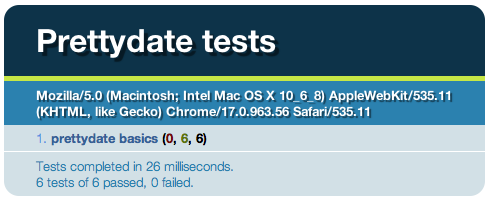

你很可能已经知道了测试的好处，但是第一件棘手的事情便是克服去在缺乏真正意义上单元概念的客户端代码上
撰写单元测试；Javascript代码通常要么分布在来自服务器的每一个页面上，要么分散在一个应用的每一个模块上，
但无论如何都与后端逻辑和相关的HTML代码紧密的混合在一起。在最坏的情况下，代码会和HTML完全揉合在一起， 
比如行内事件处理。

当还没有任何用来抽象DOM操作的Javascript库的时候基本上都是这个样子; 相对于使用DOM APIS来绑定事件来说
在行内直接撰写要简单的多。越来越多的开发者开始选择一个像是jquery之类的库来完成DOM操作，这样他们就可以
将行内事件转移到一个单独的脚本中，或者处于同一个页面上或者在一个单独的脚本文件里。然而，将代码放至
一个独立的文件中并不就意味着已经准备好作为一个单元来测试了。

究竟什么是单元？在最好的情况下，它会是一个让你可以在某些情况下处理一些事情的简单函数 — 一个函数
总会在你每次输入不变的内容时返回一个同上次结果一样结论。这使得单元测试变得颇为简单，但大多数时候
你还要处理一些副作用，在这里意味着一些DOM操作。不过弄明白我们可以在哪些单元构造一些代码仍然是非常有帮助的，
从而构建单元测试。

###开始构建单元测试

铭记上面提到的思想，我们显然可以说，当从最开始时就规划好就可以使得单元测试变得相当简单。但这并不是
这篇文章所要讨论的内容。爱着里我们将帮助你去解决一个更为困难的难题：扩展现有的代码并且测试重要的部分，
有效的发现和修复代码中的BUG。

再不改变其当前行为的基础上，扩展现有的代码并且将其转换至另一种布局，这就叫做重构。重构是一种很好的
用来提高一个程序代码质量的手段;因为任何一个改变都可能修改程序的行为，当单元测试已经部署好时这是最安全带。

这个 先有鸡还是先有蛋 的问题意味着要向现有的代码里添加测试，你必须冒着破坏它们的风险。所以，直到
你对单元测试有了足够的决心，你仍然应该手动测试以减小风险到最低。

话说到这里基本上差不多了。我们实战来演示一下，测试一些当前正在和页面混合和联系起来的Javascript代码。
这段代码找到所有包含title属性的链接，通过这些title以便使用相对时间来显示是什么时候被发布的,譬如“5天以前”：

    <!doctype html>
    <html>
    <head>
      <meta charset="utf-8">
      <title>Mangled date examples</title>
      
    </head>
    <body>
     
    <ul>
      <li class="entry">
        
blah blah blah...

        <small class="extra">
          Posted 
            <a href="/2008/01/blah/57/" title="2008-01-28T20:24:17Z">
              January 28th, 2008
            </a>
          
          by <a href="/john/">John Resig</a>
        </small>
      </li>
      <!-- more list items -->
    </ul>
     
    </body>
    </html>

如果你运行了上面的例子，你就会发现一个问题：没有任何一个日期被如愿替换了。尽管这段代码正常运行，
它遍历页面上的每一个超链接并且检查他们的title属性，然后传递给 `prettyDate` 函数。
如果 `prettyDate`返回了一个结果，他就会使用该结果来更新此链接的 `innerHTML`。

###让一切变得可测试

问题在于，任何一个超过31天的日期， `prettyDate`都仅仅返回一个undefined（明显的，通过
简简单单的 `return`语句），使得链接的文本也变成这样。所以，要来看看什么将会发生，我们可以硬编码一个“current”日期”：

    <!doctype html>
    <html>
    <head>
      <meta charset="utf-8">
      <title>Mangled date examples</title>
      
    </head>
    <body>
     
    <ul>
      <li class="entry">
        
blah blah blah...

        <small class="extra">
          Posted 
            <a href="/2008/01/blah/57/" title="2008-01-28T20:24:17Z">
              January 28th, 2008
            </a>
          
          by <a href="/john/">John Resig</a>
        </small>
      </li>
      <!-- more list items -->
    </ul>
     
    </body>
    </html>

+ [运行这个例子](http://qunitjs.com/resources/intro/1-mangled.html)

现在，这个链接应该会显示“2 hours ago,” "Yesterday"等等。这终于有点意义，但是实际上仍然不是一个
可测试的单元。所以，在不再更改代码的前提下，我们还能做的仅仅是间车DOM的变化。即使这方法有效，一点
表面上细微的改变都会破坏此次测试，导致一个成本效益比极其糟糕的测试。

###重构，第一步

相反，在能完成单元测试的目标下，我们仅重构必要的最少量的代码。

要让事情变得可能，我们需要做出2处改变：将当前日期作为参数传递给 `prettyDate` 函数，而不仅仅是
使用 `new Data`，并且将其转移到一个独立的文件中，这样我们就可以在一个单独的页面来加载它以完成测试。

    <!doctype html>
    <html>
    <head>
      <meta charset="utf-8">
      <title>Refactored date examples</title>
      
      
    </head>
    <body>
     
    <ul>
      <li class="entry">
        
blah blah blah...

        <small class="extra">
          Posted 
            <a href="/2008/01/blah/57/" title="2008-01-28T20:24:17Z">
              January 28th, 2008
            </a>
          
          by <a href="/john/">John Resig</a>
        </small>
      </li>
      <!-- more list items -->
    </ul>
     
    </body>
    </html>

接下来是 `prettydate.js` 的内容：

    function prettyDate(now, time){
      var date = new Date(time || ""),
        diff = (((new Date(now)).getTime() - date.getTime()) / 1000),
        day_diff = Math.floor(diff / 86400);
     
      if ( isNaN(day_diff) || day_diff < 0 || day_diff >= 31 )
        return;
     
      return day_diff == 0 && (
          diff < 60 && "just now" ||
          diff < 120 && "1 minute ago" ||
          diff < 3600 && Math.floor( diff / 60 ) +
            " minutes ago" ||
          diff < 7200 && "1 hour ago" ||
          diff < 86400 && Math.floor( diff / 3600 ) +
            " hours ago") ||
        day_diff == 1 && "Yesterday" ||
        day_diff < 7 && day_diff + " days ago" ||
        day_diff < 31 && Math.ceil( day_diff / 7 ) +
          " weeks ago";
    }

+ [运行这个测试](http://qunitjs.com/resources/intro/2-getting-somewhere.html)

现在我们终于有东西可以测试了，让我们来写一些真正的单元测试：

    <!doctype html>
    <html>
    <head>
      <meta charset="utf-8">
      <title>Refactored date examples</title>
      
      
    </head>
    <body>
     
    </body>
    </html>

+ [运行这个测试](http://qunitjs.com/resources/intro/3-first-test.html)（确保你启用了调试台，
像是Firebug或谷歌的Web Inspector）

这段代码将创建一个特设的测试框架，近视用调试台来输出信息。它并不依赖任何DOM，所以你尽可以通过
将script标签所指向的文件中的代码转移到它自己的文件来在非浏览器的Javascript环境中运行，
例如Node.js或是Rhino。

如果测试失败，他会打印出此次测试期望的和实际的结果。最后，它会输出包含总数，失败和成功次数的此次测试的结论。

如果所有测试通过，就像这里所展示的一样，你会在调试台中看到以下信息：

>
> Of 6 tests, 0 failed, 6 passed.
>

要观察下失败的情况是如何的，我们可以修改一下代码来破坏此次测试：

>
> Expected 2 day ago, but was 2 days ago.
> Of 6 tests, 1 failed, 5 passed.
>

此次特殊的方法作为验证概念来说是非常有意思的（你真的可以仅仅用几行代码就构造出一个测试器）, 使用
一个已存在的，可以提供更友善的输出，方便撰写和组织结构化测试代码的单元测试框架仍然显得更加实际。

###独一无二的 Qunit Javascript 测试套件

框架的选择通常是喜好的问题。在这篇文章的剩余部分中，我们将使用 [QUnit](http://docs.jquery.com/Qunit)
（读做 “q-unit”），因为其描述测试代码的形式和上述的测试代码很像。

    <!doctype html>
    <html>
    <head>
      <meta charset="utf-8">
      <title>Refactored date examples</title>
     
      <link rel="stylesheet" href="//code.jquery.com/qunit/qunit-1.14.0.css">
      
      
     
      
    </head>
    <body>
     
    

     
    </body>
    </html>

+ [运行这个测试](http://qunitjs.com/resources/intro/4-qunit-test.html)

我们应当花点时间来仔细的观看三部分。包括普通的格式化 HTML 标签，我们包含了三个文件：两个用于 QUnit
（`qunit.css` 和 `qunit.js`）和先前的 `prettydate.js`。

接着，还有另一个包含着实际测试代码的Script块。`test`的方法被调用了一次，传递了一个字符串作为第一
个参数（为测试命名）和一个函数作为第二个参数（作为此次测试的实际部分被运行）。这段代码接着定义了
一个 `now` 变量，并在接下来被复用，接着使用不同的参数重复调用了`equal`方法数次。 `equal`方法
作为 QUnit 在测试代码中提供的数个断言之一。第一个参数是以`now`变量作为第一个参数和一个`date`字符串
作为第二个参数调用`prettyDate`返回的结果。第二个传递给`equal`是期望的结果。如果二个结果相同，
则断言通过; 否则，断言就是失败的。

最后，在body元素中是一些QUnit定义的一些结构。这些元素是可选的。如果展现，QUnit将使用它们来输出测试结果。

结构看起来像是这样：

对于失败的测试，结果看起来会像这样：

 ---
因为这次测试包含了一个失败的断言，QUnit没有因此停止往下继续，这样我们就能立即看到哪里除了问题。同时
还输出了期望值和实际值，我们可用得到两者之间的差别（diff）,这对比较较大的字符串来说比较非常有用。
这里，哪里除了问题显得非常明显。

###重构，第二步

这些断言目前看来有些不完整，因为我们还没有测试 `n weeks ago` 这样的变体。在添加之前，我们应该考虑
重构测试代码。目前，我们在每个断言中调用`prettyDate`并且传递`now`作为参数。我们可以轻易的将其
改造成一个自定义的方法：

    QUnit.test("prettydate basics", function( assert ) {
      function date(then, expected) {
        assert.equal(prettyDate("2008/01/28 22:25:00", then), expected);
      }
      date("2008/01/28 22:24:30", "just now");
      date("2008/01/28 22:23:30", "1 minute ago");
      date("2008/01/28 21:23:30", "1 hour ago");
      date("2008/01/27 22:23:30", "Yesterday");
      date("2008/01/26 22:23:30", "2 days ago");
      date("2007/01/26 22:23:30", undefined);
    });

+ [运行此测试](http://qunitjs.com/resources/intro/5-qunit-test-refactored.html)

这里我们把`prettyDaye` 的调用放到了 `date` 里, 把 `now` 变量写在行内.我们为每个断言返回其相关
的数据,使其变得更加可读,同时其底层抽象依然很易于理解.

###测试DOM操作

现在`prettyDate`已经测试的比较充分了,现在我们将注意力转会最初的样本中.看看`prettyDate`函数,它同样选择
了一些DOM元素并在window load事件处理中更新了它们.同样的我们遵循上面提到的准则,我们应该能够改造那段代码并测试它.
进一步说,我们引进了一个模块机制用于这2个函数,以避免使得全局命名空间收到污染,并且赋予这些独立的函数以更多有
意义的名称.

    <!doctype html>
    <html>
    <head>
      <meta charset="utf-8">
      <title>Refactored date examples</title>
      <link rel="stylesheet" href="//code.jquery.com/qunit/qunit-1.14.0.css">
      
      
      
    </head>
    <body>
     
    

    

     
    <ul>
      <li class="entry">
        
blah blah blah...

        <small class="extra">
          Posted 
            <a href="/2008/01/blah/57/" title="2008-01-28T20:24:17Z"
              >January 28th, 2008</a>
          
          by <a href="/john/">John Resig</a>
        </small>
      </li>
      <li class="entry">
        
blah blah blah...

        <small class="extra">
          Posted 
            <a href="/2008/01/blah/57/" title="2008-01-27T22:24:17Z"
              >January 27th, 2008</a>
          
          by <a href="/john/">John Resig</a>
        </small>
      </li>
    </ul>
     
    

     
    </body>
    </html>

下面是 `prettyDate` 的内容:

    var prettyDate = {
      format: function(now, time){
        var date = new Date(time || ""),
          diff = (((new Date(now)).getTime() - date.getTime()) / 1000),
          day_diff = Math.floor(diff / 86400);
     
        if ( isNaN(day_diff) || day_diff < 0 || day_diff >= 31 )
          return;
     
        return day_diff === 0 && (
            diff < 60 && "just now" ||
            diff < 120 && "1 minute ago" ||
            diff < 3600 && Math.floor( diff / 60 ) +
              " minutes ago" ||
            diff < 7200 && "1 hour ago" ||
            diff < 86400 && Math.floor( diff / 3600 ) +
              " hours ago") ||
          day_diff === 1 && "Yesterday" ||
          day_diff < 7 && day_diff + " days ago" ||
          day_diff < 31 && Math.ceil( day_diff / 7 ) +
            " weeks ago";
      },
     
      update: function(now) {
        var links = document.getElementsByTagName("a");
        for ( var i = 0; i < links.length; i++ ) {
          if ( links[i].title ) {
            var date = prettyDate.format(now, links[i].title);
            if ( date ) {
              links[i].innerHTML = date;
            }
          }
        }
      }
    };

+ [运行这个测试](http://qunitjs.com/resources/intro/6-qunit-dom.html)

这个新的`prettyDate.update`函数是行内样本中的另一种形式,但是`now`参数被额外的传递给了`prettyDate.format`. 此次基于QUnit的测试由选择所有带有#qunit-fixture节点的A元素开始. body元素的内部结构也被更新,这行`
…
`是新添加的.它包含了 我们原始的样本结构,充分满足了在其中撰写有效测试的需要.通过将结果放入`$qunit-fixture`元素,我们再也不用担心一个测试结果导致的DOM变化会影响到另一个测试,因为QUnit会在每一次测试结束之后自动的重置它们.

让我们来看看`prettyDate.update`的第一次测试结果.在选取所有A元素之后,2个断言会去验证确保他们有原始的文本值.接着,`prettyDate.update`被调用,同时传递一个固定的日期(先前测试中的值).最后,另外2个断言被运行,测试这些元素的`innerHTML`值被更新为正确的格式化日期,"2 hours ago"和"Yesterday".

###重构，第三步

在接下来的测试`prettyDate.update, one day later`中,基本上做了同样的事情,除了传递了另一个不同的日期给`pretyDate.update`这一点,并且因此,2个链接会拥有不同的结果.让我们来看看是否能够改造这些测试以避免重复.

    <!doctype html>
    <html>
    <head>
      <meta charset="utf-8">
      <title>Refactored date examples</title>
      <link rel="stylesheet" href="//code.jquery.com/qunit/qunit-1.14.0.css">
      
      
      
    </head>
    <body>
     
    

    

     
    <ul>
      <li class="entry">
        
blah blah blah...

        <small class="extra">
          Posted 
            <a href="/2008/01/blah/57/" title="2008-01-28T20:24:17Z"
              >January 28th, 2008</a>
          
          by <a href="/john/">John Resig</a>
        </small>
      </li>
      <li class="entry">
        
blah blah blah...

        <small class="extra">
          Posted 
            <a href="/2008/01/blah/57/" title="2008-01-27T22:24:17Z"
              >January 27th, 2008</a>
          
          by <a href="/john/">John Resig</a>
        </small>
      </li>
    </ul>
     
    

     
    </body>
    </html>

+ [运行此次测试](http://qunitjs.com/resources/intro/7-qunit-dom-refactored.html)

这里有一个新的叫做`domtest`的新函数,它封装了之前的2个测试调用,为测试的名称引进了参数,日期字符串和2个期望值字符串.然后它被调用了2次.

###回到开始

有了这些,我们回到最开始的脚本以便查看重构后的代码是什么样子.

    <!doctype html>
    <html>
    <head>
      <meta charset="utf-8">
      <title>Final date examples</title>
      
      
    </head>
    <body>
     
    <ul>
      <li class="entry">
        
blah blah blah...

        <small class="extra">
          Posted 
            <a href="/2008/01/blah/57/" title="2008-01-28T20:24:17Z">
              January 28th, 2008
            </a>
          
          by <a href="/john/">John Resig</a>
        </small>
      </li>
      <!-- more list items -->
    </ul>
     
    </body>
    </html>

+ [运行这个测试](http://qunitjs.com/resources/intro/8-endstate.html)

对于一个飞静态的测试例子,我们已经移除了`prettyDate`的参数.总的来说,相对于第一个样本,这次重构已经
完成了一个巨大的进步.感谢我们引入的`prettyDate`模块,我们甚至可以在不污染全局空间名的前提下添加更多的功能.

###结论

测试Javascript代码并不是使用一些测试调度器和撰写一些测试代码这么简单的事情;在应用到先前手动测试的
代码上前,它通常需要一些深层次结构上的改变.通过一个例子,我们已经初步了解了如何通过改变一个模块的
现有代码结构来使用一个目的单一的测试集来运行一些测试,然后使用一个特性更为丰富的测试框架来替代它
以获得会更加有用的视觉反馈.

QUnit能提供的不仅仅是这些而已,对于像是timeouts, ajax和事件之类的异步代码给予了特别的支持.在使得
重复运行一些特定测试变得简单,对失败的断言提供一个追踪队列和捕获错误的基础上,其可视化的测试调度器
对于调试代码来说是大有裨益的.要查阅更多资料,请查阅 [The QUnit Cookbook](http://qunitjs.com/cookbook)

要转载这篇文章,请保留下面META信息,谢谢!  
[译文: http://kezhen.info/Introduction-to-Unit-Testing/](http://kezhen.info/Introduction-to-Unit-Testing/)  
[原文: http://qunitjs.com/intro/](http://qunitjs.com/intro/ "Introduction to Unit Testing | QUnit")
